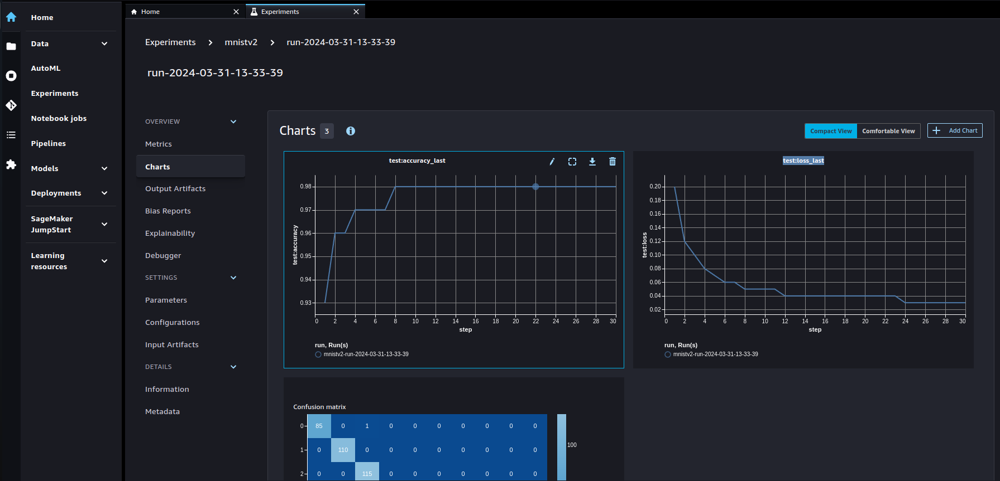
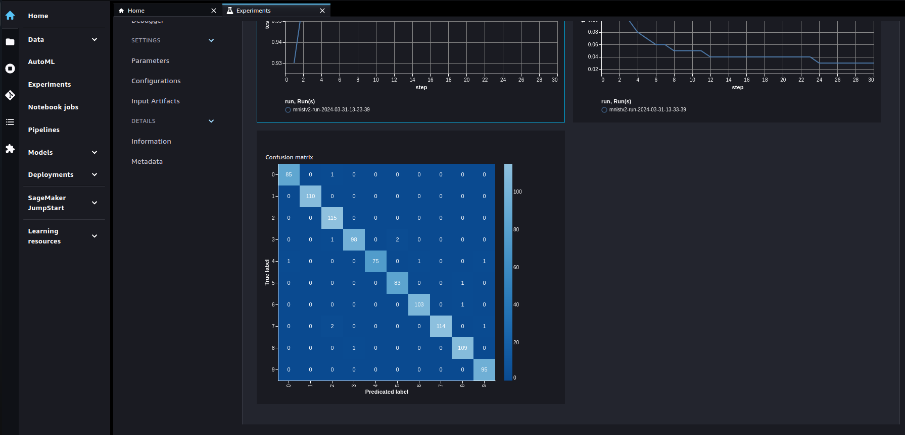
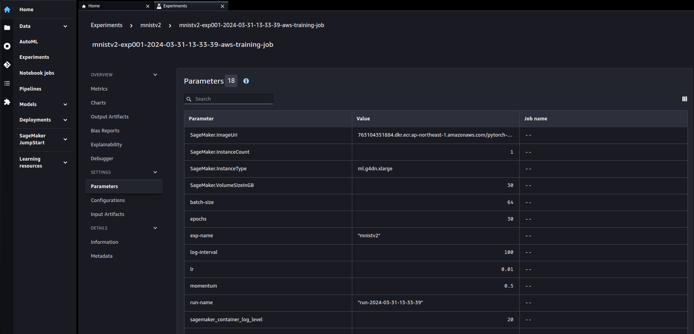

# aws-sagemaker-training-job-template <!-- omit in toc -->

本リポジトリでは，SageMaker Training Job を利用した機械学習コードの実行と実験管理を容易に行うためのテンプレートとその利用手順を示す．テンプレート内では，[MNIST データを題材としたサンプルコード](https://github.com/Renya-Kujirada/aws-sagemaker-training-job-template/blob/main/src/train.py)を用意しており，ローカルで実行している機械学習コードを最小限の修正で SageMaker Training Job として実行し，実験管理を行うための方法を解説している．併せて，[サンプルコードを SageMaker Studio などでクイックに実行するための手順書](https://github.com/Renya-Kujirada/aws-sagemaker-training-job-template/blob/main/docs/quickstart.md)も整備しているため参照されたい．

本テンプレートは，筆者が実務や Kaggle などでの SageMaker の利用経験を基に作成しており，ローカルで開発した学習コードをスムーズに SageMaker Training Job で利用できるようにすることを主眼としている．また，ローカル上または SageMaker Training Job 上どちらに対しても同一の学習コードで動作可能な状態にする方法についても述べている．

## TL;DR <!-- omit in toc -->

SageMaker Training Job を実行可能なコードテンプレートを Python コードベースで作成した．本テンプレートを利用することで，以下の機能を迅速かつ容易に利用することができる．

- SageMaker Training Job の実行（オプション指定可能）
- SageMaker Experiments を利用した実験管理
- Training Job 実行後，モデルおよびログの自動ダウンロード

## 目次 <!-- omit in toc -->

- [背景と課題](#背景と課題)
- [目的](#目的)
- [オリジナリティ](#オリジナリティ)
- [前提](#前提)
  - [環境](#環境)
  - [ディレクトリ構成](#ディレクトリ構成)
  - [コード](#コード)
- [手順](#手順)
- [手順の各ステップの詳細](#手順の各ステップの詳細)
  - [データセットの準備と S3 へのアップロード](#データセットの準備と-s3-へのアップロード)
  - [学習スクリプト（`train.py`）および依存関係ファイルを用意](#学習スクリプトtrainpyおよび依存関係ファイルを用意)
    - [データセットを格納しているディレクトリの設定](#データセットを格納しているディレクトリの設定)
    - [アーティファクト（モデル，メトリクス等）の保存先の設定](#アーティファクトモデルメトリクス等の保存先の設定)
    - [SageMaker Experiments の利用設定（任意）](#sagemaker-experiments-の利用設定任意)
  - [ローカル上での動作確認](#ローカル上での動作確認)
  - [ハイパーパラメーターを定義した yaml ファイルを`config`ディレクトリに格納](#ハイパーパラメーターを定義した-yaml-ファイルをconfigディレクトリに格納)
  - [Training Job を実行し，作成されたモデル・CloudWatch Logs を自動ダウンロード](#training-job-を実行し作成されたモデルcloudwatch-logs-を自動ダウンロード)
    - [`run_job.py`の概要](#run_jobpyの概要)
    - [実行方法](#実行方法)
    - [Training Job の実行結果の保存先](#training-job-の実行結果の保存先)
- [Tips](#tips)
  - [Training Job 実行環境について](#training-job-実行環境について)
  - [Training Job の設定について](#training-job-の設定について)
  - [Experiments について](#experiments-について)

## 背景と課題

Amazon SageMaker Training Job とは，① 用意したコードを ② 用意したデータと ③ 用意した環境で実行し，④ 結果を自動で保存するバッチ処理サービスである[^1-1]．SageMaker Training Job を利用することで，データサイエンティストは学習に必要なインフラ管理から解放され，機械学習のコード開発に注力することができる．また，SageMaker Training Job では，SageMaker Experiments という機能を利用することで，WandB や MLflow のような実験管理が容易に実現可能になる．通常，機械学習コードの開発初期はローカルで動作確認などを行い，ハイパーパラメーターチューニングや複数設定での比較実験などで SageMaker Training Job, Experiments を利用するケースが多い．

初学者にとって，ローカルで実行していた学習コードを SageMaker Training Job で動作するように修正し，Training Job を実験管理機能を含めて活用することは，少々難しいように思われる．その理由としては，実務や Kaggle などの機械学習プロジェクトで即時転用可能な，Training Job の**Python スクリプトベース**の実装例が少ないことが挙げられる．（AWS 公式リポジトリでは，**Jupyter Notebook ベース**の解説コードは豊富に存在する．[^1-2] [^1-3] [^1-4]）加え，SageMaker Training Job 中で，SageMaker Experiments による実験管理を行うための実装例は非常に少ない．

## 目的

業務における機械学習の PoC や Kaggle において，ローカル上で開発した学習コードを迅速かつ容易に SageMaker Training Job として実行可能な Python スクリプトを作成し，再利用可能なようにテンプレートとして整備する．また，テンプレート内に MNIST データセットを利用した具体的な実装例を含め，SageMaker Training Job や SageMaker Experiments の利用方法を解説することも目的としている．本テンプレートを利用することにより，初学者が SageMaker 上での学習・実験管理を行えるようになることを目指している．

## オリジナリティ

- Training Job を容易に実行するための Python スクリプト(`scripts/run_job.py`)を作成している
  - `train.py` のハイパーパラメータを外部の yaml ファイルで管理し，それを読み込み training job に渡すように工夫している
- SageMaker Training Job 実行後に以下を自動ダウンロードしている
  - 学習済みモデル
  - CloudWatch Logs の実行ログ（失敗時には原因究明がスムーズになる）
- ローカル・SageMaker Training Job 問わず，修正無しに実行可能な学習スクリプト(`train.py`)の実装例を紹介している
  - SageMaker Experiments の利用方法も紹介している

## 前提

### 環境

- SageMaker Studio，または，sagemaker>=2.213.0 がインストールされた ML 実行環境上での実行を想定している．
  - 本リポジトリは，[AWS Deep Learning Containers (DLCs)](https://github.com/aws/deep-learning-containers/blob/master/available_images.md)のイメージをベースとした VSCode Dev Containers 上で開発を行っている．Training Job と同一環境での Training コードの動作確認を行えるため，開発効率が良い．詳細は[VSCode Dev Containers を利用した AWS EC2 上での開発環境構築手順](https://github.com/Renya-Kujirada/aws-ec2-devkit-vscode)を参照されたい．
- 機械学習フレームワークとして PyTorch の利用を想定している．
  - 勿論，TensorFlow，MXNet，HuggingFace などにも対応させることも可能．（`scripts/run_job.py` を修正する必要あり）

### ディレクトリ構成

本リポジトリは，以下のディレクトリ構成を想定している．`src`ディレクトリに学習スクリプト（`train.py`）を格納し，`scripts/run_job.py`によって`train.py`を SageMaker Training Job で実行する想定である．また，ローカル上で`train.py`を実行する際のデータセットの格納先は，`dataset`ディレクトリを想定している．

```
.
├── config      :   学習スクリプトのハイパーパラメーターを定義したyamlを格納
├── dataset     :   データセットを格納（ローカルで学習スクリプトを実行する際に利用）
├── rawdata     :   Rawデータを格納（任意）
├── result
│   ├── model   :   モデルの重みを保存（Training Job実行後に自動ダウンロード）
│   └── output  :   モデルの学習時のその他出力物を保存（ローカルで学習スクリプトを実行する際に利用）
├── scripts     :   Training Jobを実行するためのコードを格納
└── src         :   学習スクリプトを格納
```

### コード

- 以下のファイルは`src`ディレクトリに格納する
  - 学習スクリプト（`train.py`という名前を想定している）
  - `train.py`で利用しているモジュール
  - `train.py`の実行に必要な依存関係ファイル（`requirements.txt`）
    - Training Job 実行時，コンテナ上に自動で install される
- `train.py`内部では，`argparse`を利用してハイパーパラメーターを動的に変更できるようにする
  - SageMaker Experiments でメトリクスと紐付けて自動記録するため
- `train.py`で設定するハイパーパラメーターは，`config`ディレクトリ内部の yaml ファイルで管理する

## 手順

本テンプレートを利用して，学習スクリプトを SageMaker Training Job で実行するための手順を以下に示す．

- データセットの準備と S3 へのアップロード
- 学習スクリプト（`train.py`）および依存関係ファイルを用意
- ハイパーパラメーターを定義した yaml ファイルを`config`ディレクトリに格納
- Training Job を実行し，作成されたモデル・CloudWatch Logs を自動ダウンロード

## 手順の各ステップの詳細

### データセットの準備と S3 へのアップロード

`dataset`ディレクトリに，`train.py`で利用するデータセットを準備する．その後，`src`ディレクトリ内部で以下のように`upload_dataset.py`を実行することで，データセットを S3 に upload する．

```
python upload_dataset.py
```

デフォルトのデータセット upload 先（S3 URI）は以下である．

```
s3://sagemaker-{REGION}-{ACCOUNT_ID}/dataset
```

なお，`upload_dataset.py`では，コマンドライン引数を指定することで，upload 先の S3 URI や region を変更可能である．（例えば，引数`--prefix`のデフォルト値は`dataset`となっているが，これを`dataset/pj-name`とすると，`s3://sagemaker-{REGION}-{ACCOUNT_ID}/dataset/pj-name`に upload されるようになる．）

### 学習スクリプト（`train.py`）および依存関係ファイルを用意

`train.py`，`train.py`で利用しているモジュール，および`train.py`の実行に必要な依存関係ファイル（`requirements.txt`）を`src`ディレクトリに格納する．参考のために，本リポジトリでは MNIST の画像分類のための`train.py`を作成している．

SageMaker Training Job で`train.py`を実行するために留意すべき点は以下である．

- データセットを格納しているディレクトリの設定
- アーティファクト（モデル，メトリクス等）の保存先の設定
- SageMaker Experiments の利用設定（任意）
- ローカル上での動作確認

以下，具体的な修正点を簡易解説する．

#### データセットを格納しているディレクトリの設定

`train.py`上では，`argparse`を利用して，データセット格納先を以下のように定義することを推奨する．

```py
parser.add_argument(
    "--data-dir",
    type=str,
    default=os.environ["SM_CHANNEL_TRAINING"],
)
```

Training Job が実行されるコンテナでは，指定した S3 上のデータセットが`/opt/ml/input/data/training`に転送され，コンテナ上の環境変数`SM_CHANNEL_TRAINING`にディレクトリパスが格納される仕様である．よって，コード上では，`args.data_dir`でデータセットのディレクトリパスにアクセスする．なお，Training Job では，他にも様々な環境変数が利用可能である[^2-1][^2-2]ので，実装の際には公式リポジトリなどを参考にされたい．

#### アーティファクト（モデル，メトリクス等）の保存先の設定

`train.py`上では，`argparse`を利用して，モデルやその他出力物の保存先を以下のように定義することを推奨する．

```py
parser.add_argument(
    "--model-dir",
    type=str,
    default=os.environ["SM_MODEL_DIR"],
)
parser.add_argument(
    "--out-dir",
    type=str,
    default=os.environ["SM_OUTPUT_DATA_DIR"],
)
```

前述の`SM_CHANNEL_TRAINING`と同様に，コンテナ上の環境変数`SM_MODEL_DIR`，`SM_OUTPUT_DATA_DIR`には，それぞれ`/opt/ml/model`，`/opt/ml/output`が格納されており，Training Job 終了後に各々のディレクトリに保存されたデータが S3 に自動で転送・保存される仕様である．前述のディレクトリ以外は，Training Job 終了時に全て削除されるため，Job 実行時に生成されるモデルの重みファイルは`/opt/ml/model`に，その他ファイルは`/opt/ml/output`に保存すると良い．

#### SageMaker Experiments の利用設定（任意）

SageMaker Experiments は，SageMaker の機能の一つであり，機械学習の実験を追跡，整理，比較するための機能を提供する．噛み砕いて説明すると，MLflow の AWS 版だと考えれば良く，`Experiment`という単位の中に，実行毎に`Run`という単位でパラメーター（loss，accuracy の推移や混同行列，ハイパーパラメーターなど）を記録することができる．

Training Job 中で利用する場合，`train.py`上では，以下のように Training Job 実行時に指定された`Experiment`と`Run`の情報を渡す必要がある．

```py

from sagemaker.experiments import load_run

with load_run(experiment_name=args.exp_name, run_name=args.run_name) as run:
    train(args, run)
```

基本的には，`train.py`上で，Experiments の API を呼ぶことでパラメーターを記録することができる．例えば，混同行列を記録したい場合は，

```py
run.log_confusion_matrix(target.cpu(), pred.cpu(), "Confusion-Matrix-Test-Data")
```

のように記述し，epoch 毎のパラメーター値を記録したい場合は，

```py
run.log_metric(name="test:accuracy", value=accuracy, step=epoch)
```

のように記述すると良い．詳細については，公式ドキュメント[^3-1][^3-2][^3-3]やブログ[^3-4]を参考にされたい．

なお，本リポジトリ上では，ローカル上でも SageMaker Training Job 上でも同一コードで動作させるために，ローカル実行の場合は明示的に`run = None`としており，run によって，API を実行するか否かを自動判定させている．

SageMaker Studio における SageMaker Experiments の UI については，Tips の章にて紹介するので参照されたい．

### ローカル上での動作確認

SageMaker Training Job を実行する前に，SageMaker Training Job を模して ローカルで動作確認を行うことは，実験効率の観点で重要である．Training Job を実行する際，Job 実行用のインスタンス・コンテナ起動時間などの待ち時間が発生するためである．以下のような shell スクリプトを作成し，実際に実行してみることを推奨する（本リポジトリでは，`src`ディレクトリ内に`train.sh`という shell スクリプトを用意している）．

```sh
#!/bin/bash
cd "$(dirname "$0")"

export SM_CHANNEL_TRAINING="../dataset"
export SM_OUTPUT_DATA_DIR="../result/output"
export SM_MODEL_DIR="../result/model"

python train.py
```

`bash train.sh`を実行することで，`dataset`ディレクトリ上のデータセットを入力とし，`result/model`ディレクトリには学習後のモデルの重みファイルが，`result/output`ディレクトリにはその他ファイル（本リポジトリの`train.py`の場合，epoch 毎のメトリクスとモデルの重みファイル）が保存されることを確認できる．

### ハイパーパラメーターを定義した yaml ファイルを`config`ディレクトリに格納

`train.py`上で`argparse`で指定しているハイパーパラメーターを`exp_<3桁の実験番号>.yaml`という名前で保存しておく．Training Job 実行時に`yaml.safe_load`で dict 形式で load し，SageMaker Estimator に容易に渡せるためである．経験上，実験毎に yaml ファイルを作成し，`exp001.yaml`, `exp002.yaml`,,,というようにパラメーターを管理することが多い．

### Training Job を実行し，作成されたモデル・CloudWatch Logs を自動ダウンロード

`scripts/run_job.py`を実行することで，Training Job を実行することができる．

#### `run_job.py`の概要

`scripts`ディレクトリ内部で`run_job.py`を実行することで，`src`ディレクトリ内の`train.py`が Training Job によって実行される．また，Training Job により作成されたモデル，実行ログ（CloudWatch Logs），実験情報（モデルの S3 URI, および job name）は自動ダウンロードされる．なお，Training Job の成否に関わらず，CloudWatch Logs のログはダウンロードするよう実装している．これにより，Training Job の実行に失敗した場合，迅速にエラー解析が可能になる．

#### 実行方法

`run_job.py`では，SageMaker Pytorch Estimator の一部の引数[^4-1]をコマンドライン引数として指定することができる．全てを説明しないが，利用頻度が高そうなものを紹介する．

- `--config`: Pytorch Estimator の引数`hp`に渡すためのハイパーパラメーターを定義した yaml ファイルパス
- `--dataset-uri`: データセットを格納している S3 URI
- `--exp-name`: Training Job の job 名の prefix，および SageMaker Experiments 名
- `--instance-type`: インスタンスタイプ（デフォルトは`ml.g4dn.xlarge`）
- `--input-mode`: データセットを Training Job 開始前にコンテナにダウンロードするか，Training Job 実行中にストリーミングで取得するかを指定可能．詳細は公式ブログ[^4-2]を参照されたい．
- `--use-spot`: スポットインスタンスを使用するかを指定可能．(デフォルトでは利用しない)

`run_job.py`を容易に実行するために`run_job.sh`を用意している．`run_job.sh`の 9 行目，10 行目，12 行目を編集することで，利用可能である．以下に`run_job.sh`の中身を示す．9 行目の変数`EXP_NAME`には任意の実験名を，10 行目の変数`ACCOUNT_ID`には自身の AWS アカウント ID を，12 行目の変数`DATASET_S3_URI`には Training Job に転送したいデータセットの S3 URI を指定する．なお，12 行目は`src/upload_dataset.py`実行時に引数`--prefix`を指定していない場合は変更不要である．

```sh
#!/bin/bash
cd "$(dirname "$0")"

## config setting
EXP_ID=$1 # three digits number for experiment id
CONF_PATH=../config/exp$EXP_ID.yaml

## experiments setting
EXP_NAME=mnist
ACCOUNT_ID=XXXXXXXXXXXX
REGION=ap-northeast-1
DATASET_S3_URI=s3://sagemaker-$REGION-$ACCOUNT_ID/dataset
INSTANCE_TYPE=ml.g4dn.xlarge
OUT_DIR=../result/model

# if you use spot instance, add --use-spot
python run_job.py --config $CONF_PATH \
    --dataset-uri $DATASET_S3_URI \
    --exp-name $EXP_NAME \
    --instance-type $INSTANCE_TYPE \
    --region $REGION \
    --out-dir $OUT_DIR
```

その後，`scripts`ディレクトリ内部にて，以下のコマンドで，3 桁の実験番号を引数として指定して`run_job.sh`を実行する．ここで，3 桁の実験番号は，`config`ディレクトリの`exp_<3桁の実験番号>.yaml`のファイル名の末尾の番号である．

```sh
bash run_job.sh 001
```

上記コマンドにより，`src/run_job.py`が実行され，Training Job を実行することができる．

#### Training Job の実行結果の保存先

Training Job 実行に伴い作成される SageMaker Experiments 名および Run 名，S3 へのモデルの保存先（S3 URI），およびローカルへのダウンロード先（ディレクトリ）を以下に示す．大文字部分は`run_job.sh`内部で定義している変数値，yyyy-mm-dd-hh-mm-ss は実行時のタイムスタンプである．

- SageMaker Experiments 名: `{EXP_NAME}`
- SageMaker Experiments Run 名: `run-{yyyy-mm-dd-hh-mm-ss}`
- モデル保存先（S3 URI）: `s3://sagemaker-{REGION}-{ACCOUNT_ID}/dataset/result-training-job-{self.exp_name}`
- モデルダウンロード先（ローカル）: `../result/model/{yyyy-mm-dd-hh-mm-ss}`

## Tips

### Training Job 実行環境について

- ローカルで学習スクリプトを開発する際，可能な限り SageMaker Training Job の実行環境と統一することが望ましい．これを実現するため，[AWS Deep Learning Containers (DLCs)](https://github.com/aws/deep-learning-containers/blob/master/available_images.md)のイメージを利用した Docker Container 上で開発すると良い．[DLCs のコンテナを EC2 上で立て，VSCode で開発する方法を解説したリポジトリ](https://github.com/Renya-Kujirada/aws-ec2-devkit-vscode/blob/main/README.md)があるので，詳細はそちらを参照されたい．

### Training Job の設定について

- `scripts/run_job.py`では，デフォルトで Training Job で SageMaker Managed Warm Pools[^5-1]を利用する．本機能は，Training Job を実行後，その際に使用したインスタンスを停止せずに保持しておき，待ち時間無く Training Job を再実行可能な機能である（保持中は課金されることに注意）．Warm pool を使用する場合，インスタンスタイプごとに上限緩和申請が必要である．

- `scripts/run_job.py`では，引数`--use-spot`を指定することで，Training Job でスポットインスタンス[^5-2]を利用することが可能である．スポットインスタンスを利用することで，70%〜90%のコスト削減を見込める．個人的な感覚では，待ち時間はオンデマンドインスタンスとほぼ変わらない印象である．Training Job 内部で複数回連続して動作確認を行いたい場合は Warm Pool を，その他の場合はスポットインスタンスを利用することを推奨する（勿論，学習を止めたくない場合や待ち時間が長い場合はオンデマンドインスタンスを利用したほうが良い）．

### Experiments について

- 現時点（2024/03/31）では，SageMaker Experiments を利用したロギング結果は，SageMaker Studio Classic 上で確認できる[^5-3]．SageMaker Studio では確認できないことに注意されたい（同様に SageMaker Jumpstart，SageMaker MLOps Template も同様に Classic からのみ利用可能）．

- SageMaker Studio Classic 上での Experiments の UI を以下に示す．以下の例では，`mnistv2`という Experiment の中に`run-2024-03-31-13-33-39`という Run が存在しており，その中で学習コード上のメトリクスが記録されていることを確認できる．

  
  

- 現時点（2024/03/31）では，`run_job.py`上で作成した Run 上に`train.py`上のメトリクスを記録できない．`train.py`上で別の Run が作成され，その中にメトリクスが保存されることを確認している．（つまり，`run_job.py`上で作成される Run には以下のようにハイパラやインスタンス情報が，`train.py`上で作成される Run にはメトリクスが保存される．この事象は仕様なのか現在サポートに問い合わせているが，恐らく改善されるのではないかと思っている．）

  

- 同一名の Experiments に紐付けられる Run の総数は 50 である（SageMaker が自動作成したものを除く）[^5-4]．50 を超えると以下のエラーが発生するため，Experiments Name を変更する必要がある．

```
botocore.errorfactory.ResourceLimitExceeded: An error occurred (ResourceLimitExceeded) when calling the AssociateTrialComponent operation: The account-level service limit 'Total number of trial components allowed in a single trial, excluding those automatically created by SageMaker' is 50 Trial Components, with current utilization of 0 Trial Components and a request delta of 51 Trial Components. Please use AWS Service Quotas to request an increase for this quota. If AWS Service Quotas is not available, contact AWS support to request an increase for this quota.
```

- `train.py`内での SageMaker Experiments の実装について，本リポジトリ上では ExperimentsName 並びに RunName をトレーニングジョブ内のスクリプトに明示的に指定することで，`run_job.py`上で作成した Run を利用して記録するようにしているが，公式の実装例[^3-3]のように，`boto3.session.Session`を利用する方法でも問題なく記録することが可能である．以下に具体的な実装例を示す．

```py
import boto3
from sagemaker.session import Session

session = Session(boto3.session.Session(region_name="ap-northeast-1"))
with load_run(sagemaker_session=session) as run:
    train(args, run)
```

- `train.py`の実装については，[^1-3] [^1-4] [^3-4] を参考にし，改良している．末尾ではあるが，ここで感謝申し上げたい．

## References <!-- omit in toc -->

[^1-1]: [エンジニア目線で始める Amazon SageMaker Training ① 機械学習を使わないはじめての Training Job](https://qiita.com/kazuneet/items/795e561efce8c874d115)
[^1-2]: [sagemaker/sagemaker-experiments/pytorch_mnist/src/mnist_train.py](https://github.com/aws-samples/aws-ml-jp/blob/main/sagemaker/sagemaker-experiments/pytorch_mnist/src/mnist_train.py)
[^1-3]: [sagemaker/sagemaker-training/tutorial/2_2_rewriting_traing_code_for_sagemaker_pytorch.ipynb](https://github.com/aws-samples/aws-ml-jp/blob/main/sagemaker/sagemaker-training/tutorial/2_2_rewriting_traing_code_for_sagemaker_pytorch.ipynb)
[^1-4]: [sagemaker/sagemaker-experiments/pytorch_mnist/pytorch_mnist.ipynb](https://github.com/aws-samples/aws-ml-jp/blob/main/sagemaker/sagemaker-experiments/pytorch_mnist/pytorch_mnist.ipynb)
[^2-1]: [ENVIRONMENT_VARIABLES.md ](https://github.com/aws/sagemaker-training-toolkit/blob/master/ENVIRONMENT_VARIABLES.md)
[^2-2]: [SageMaker Training Toolkit - ENVIRONMENT_VARIABLES.md 日本語版](https://zenn.dev/kmotohas/articles/7bfe313eab01ea)
[^3-1]: [Amazon SageMaker Experiments > Experiments](https://sagemaker.readthedocs.io/en/stable/experiments/sagemaker.experiments.html)
[^3-2]: [Next generation Amazon SageMaker Experiments – Organize, track, and compare your machine learning trainings at scale](https://aws.amazon.com/jp/blogs/machine-learning/next-generation-amazon-sagemaker-experiments-organize-track-and-compare-your-machine-learning-trainings-at-scale/)
[^3-3]: [Track an experiment while training a Pytorch model with a SageMaker Training Job](https://sagemaker-examples.readthedocs.io/en/latest/sagemaker-experiments/sagemaker_job_tracking/pytorch_script_mode_training_job.html)
[^3-4]: [新しくなった Amazon SageMaker Experiments で実験管理](https://qiita.com/mariohcat/items/9fde1b04c0ecf439d427)
[^4-1]: [Training APIs > Estimators](https://sagemaker.readthedocs.io/en/stable/api/training/estimators.html)
[^4-2]: [Choose the best data source for your Amazon SageMaker training job](https://aws.amazon.com/jp/blogs/machine-learning/choose-the-best-data-source-for-your-amazon-sagemaker-training-job/)
[^5-1]: [Train Using SageMaker Managed Warm Pools](https://docs.aws.amazon.com/sagemaker/latest/dg/train-warm-pools.html)
[^5-2]: [Use Managed Spot Training in Amazon SageMaker](https://docs.aws.amazon.com/ja_jp/sagemaker/latest/dg/model-managed-spot-training.html)
[^5-3]: [https://docs.aws.amazon.com/sagemaker/latest/dg/experiments.html](https://docs.aws.amazon.com/ja_jp/sagemaker/latest/dg/experiments.html)
[^5-4]: [Amazon SageMaker endpoints and quotas](https://docs.aws.amazon.com/general/latest/gr/sagemaker.html)
